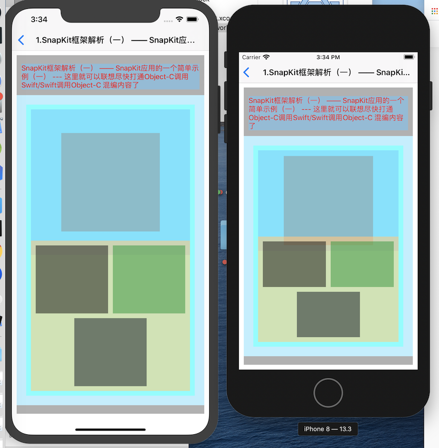

# OCInterview
OC interview summary


---

2020年05月25日


17.[SnapKit框架解析（一） —— SnapKit应用的一个简单示例（一）](https://www.jianshu.com/p/daa3496c9736)
    
    17.1 Common公共类、Base基类、Home等目录更新；
    17.2 func initView() {
        self.view.addSubview(bgView)
        //这里SnapKit使用了闭包
        bgView.snp.makeConstraints { (ConstraintMaker) in
            //注意这里直接就适配顶部和底部的安全距离了
            ConstraintMaker.top.equalTo(self.view.snp_topMargin).offset(kMargin);
            ConstraintMaker.bottom.equalTo(self.view.snp_bottomMargin).offset(-kMargin);
            ConstraintMaker.left.equalTo(kMargin)
            ConstraintMaker.right.equalTo(-kMargin)
        }
        bgView.addSubview(titleLabel)
        titleLabel.snp.makeConstraints { (make) in
            make.top.equalTo(bgView.snp_topMargin).offset(kMargin)
            make.leading.equalTo(kMargin)
            make.trailing.equalTo(-kMargin)
        }
    }
    17.3

16.[16.100 Days of SwiftUI-待学习](https://www.jianshu.com/p/dc1ef05d9d4f)

---
2020年05月22日

15.[(翻译) SwiftUI -- 手势的实现](https://www.jianshu.com/p/457ef71cb8e8)

---

2020年05月21日

14.[五、(翻译) SwiftUI -- 创建详情页](https://www.jianshu.com/p/f71231a19297)

13.[四、(翻译) SwiftUI -- 理解 Binding](https://www.jianshu.com/p/ed9d278a04a0)

12.[三、(翻译)SwiftUI -- 动态列表和 Identifiable](https://www.jianshu.com/p/2713f904a405)

11.[二、(翻译) SwiftUI - 理解 State](https://www.jianshu.com/p/aace56356aa7)

10.[一、(翻译) SwiftUI - 怎样去开始一个新项目](https://www.jianshu.com/p/3828c5a5ba92)

9.[Swift 5.1 极简参考手册](https://blog.csdn.net/zsxjtip/article/details/104155074?ops_request_misc=&request_id=&biz_id=102&utm_term=swift5.1&utm_medium=distribute.pc_search_result.none-task-blog-2~all~sobaiduweb~default-3-104155074) 
```    
2020年05月14日
8.Swift 教程：https://swiftgg.gitbook.io/swift/swift-jiao-cheng
    「Playground编写测试代码有些提示不支持-还是改用Xcode吧！」
    1.基础部分
    20200510Swift学习一期「留存」
```
---
```
2020年05月07日
7.cell选择动作取消
6.表格布局简单初步尝试(表格cell的点击事件-字符串拼接)
5.引入cocopods / pod 'SnapKit'
4.Sketch 结合 App Icon Gear绘制图标更新(感觉图标还是得再更新不太好看-文字边框改为了白色，其他渐变)
```
---
```
2020年05月06日
3.Swift项目 SceneDelegate非Storyboard方式启动
2.Object-C项目、Swift 项目 iOS 13 SceneDelegae适配-纯代码
1.Xcode Version 11.4.1新建Swift项目
```