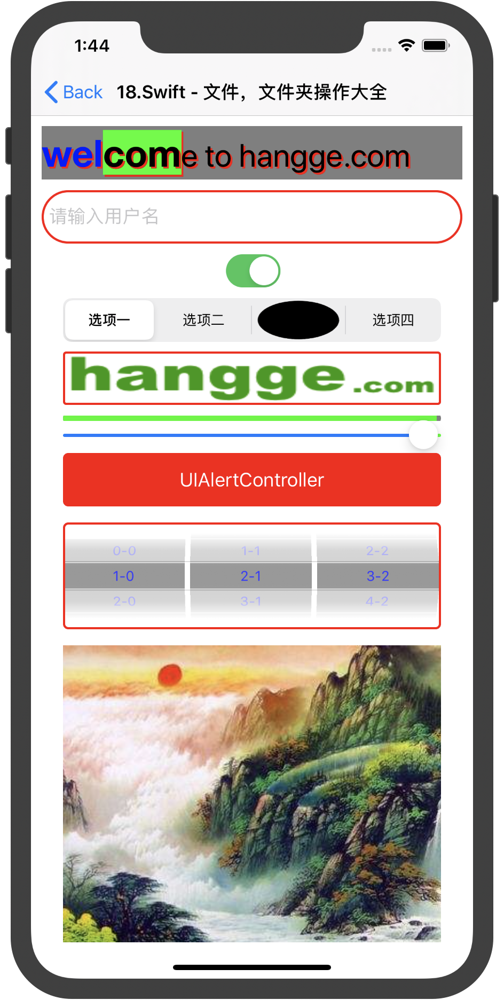
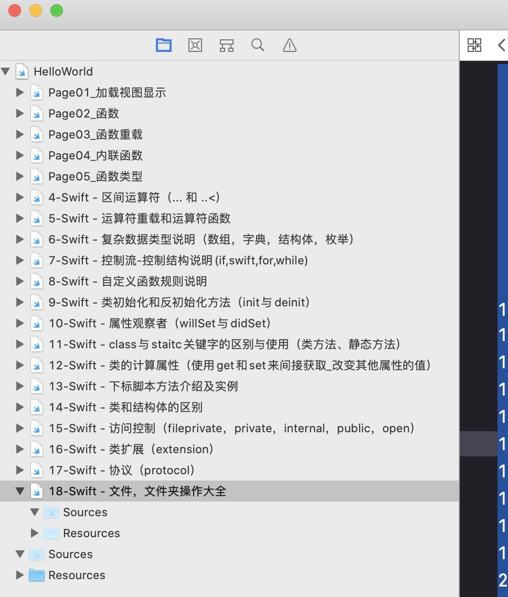

### Swift
>Swift是苹果公司在WWDC2014上发布的全新开发语言，用于搭建基于苹果平台的应用程序。其语法内容混合了OC、JS、Python，语法简单，使用方便，并可与OC混合使用。
>https://www.hangge.com/blog/cache/category_72_42.html

---
2020年06月04日 ↓

[37.]()

2020年06月03日 ↓

[36.Swift - 给表格的单元格UITableViewCell添加图片，详细文本标签](https://www.hangge.com/blog/cache/detail_558.html)

[35.Swift - 使用表格组件（UITableView）实现单列表](https://www.hangge.com/blog/cache/detail_552.html)

[34.Swift - 日期选择控件（UIDatePicker）的用法](https://www.hangge.com/blog/cache/detail_547.html)

[33.Swift - 各种手势检测大全（UIGestureRecognizer及其子类）](https://www.hangge.com/blog/cache/detail_546.html)

[32.Swift - 选择框（UIPickerView）的用法](https://www.hangge.com/blog/cache/detail_541.html)

2020年06月02日 ↓

[31.Swift - 告警框（UIAlertView）的用法->Swift - 告警提示框（UIAlertController）的用法](https://www.hangge.com/blog/cache/detail_651.html)

[30.Swift - 滑块（UISlider）的用法](https://www.hangge.com/blog/cache/detail_536.html)

>/Users/nixs/Desktop/20200513/Swift_Study/20200525Swift学习四期/InterviewSwift/InterviewSwift/20200601基础控件/FileEditViewController.swift ↓

>[29.Swift使用GCD实现延迟和取消操作](https://www.jianshu.com/p/6e646fc38a86)

>[28.Swift多线程:使用GCD实现异步下载图片](https://www.jianshu.com/p/de4c990f64e9)

[27.Swift - 进度条（UIProgressView）的用法](https://www.hangge.com/blog/cache/detail_535.html)

[26.Swift—抛异常(do..catch)与（try,try?,try!）的使用](https://www.jianshu.com/p/50b3d40f1150)

[25.Swift - 图像控件（UIImageView）的用法](https://www.hangge.com/blog/cache/detail_534.html)

[24.【基础语法】 --- Swift - as、as!、as?三种类型转换操作符使用详解（附样例）](https://www.hangge.com/blog/cache/detail_1089.html)

[23.Swift - 分段选择控件（UISegmentedControl）的用法](https://www.hangge.com/blog/cache/detail_533.html)

2020年06月01日 ↓

[22.Swift - 开关按钮（UISwitch）的用法](https://www.hangge.com/blog/cache/detail_532.html)

[21.Swift - 多行文本输入框（UITextView）的用法](https://www.hangge.com/blog/cache/detail_531.html)

[20.Swift - 文本输入框（UITextField）的用法](https://www.hangge.com/blog/cache/detail_530.html)

[19.Swift - 文本标签（UILabel）的用法](https://www.hangge.com/blog/cache/detail_528.html)

[18.Swift - 文件，文件夹操作大全](https://www.hangge.com/blog/cache/detail_527.html)

[17.Swift - 协议（protocol）](https://www.hangge.com/blog/cache/detail_526.html)

[16.Swift - 类扩展（extension）](https://www.hangge.com/blog/cache/detail_525.html)

[15.Swift - 访问控制（fileprivate，private，internal，public，open）](https://www.hangge.com/blog/cache/detail_524.html)

[14.Swift - 类和结构体的区别]()

[13.Swift - 下标脚本方法介绍及实例](https://www.hangge.com/blog/cache/detail_522.html)

[12.Swift - 类的计算属性（使用get和set来间接获取/改变其他属性的值）](https://www.hangge.com/blog/cache/detail_521.html)

[11.Swift - class与staitc关键字的区别与使用（类方法、静态方法）](https://www.hangge.com/blog/cache/detail_520.html)

[10.Swift - 属性观察者（willSet与didSet）](https://www.hangge.com/blog/cache/detail_519.html)

[9.Swift - 类初始化和反初始化方法（init与deinit）](https://www.hangge.com/blog/cache/detail_518.html)

[8.Swift - 自定义函数规则说明](https://www.hangge.com/blog/cache/detail_517.html)

[7.Swift - 控制流/控制结构说明（if，switch，for，while）](https://www.hangge.com/blog/cache/detail_516.html)

[6.Swift - 复杂数据类型说明（数组，字典，结构体，枚举）](https://www.hangge.com/blog/cache/detail_515.html)

[5.Swift - 运算符重载和运算符函数](https://www.hangge.com/blog/cache/detail_514.html)

[4.Swift - 区间运算符（... 和 ..<）](https://www.hangge.com/blog/cache/detail_513.html)

>以后(4...)基础语法的测试代码在Playground里测试

[3.Swift - 使用arc4random()、arc4random_uniform()取得随机数](https://www.hangge.com/blog/cache/detail_512.html)

[2.Swift - 基本数据类型，及常/变量声明](https://www.hangge.com/blog/cache/detail_511.html)

[1.Swift - 按钮（UIButton）的用法](https://www.hangge.com/blog/cache/detail_529.html)